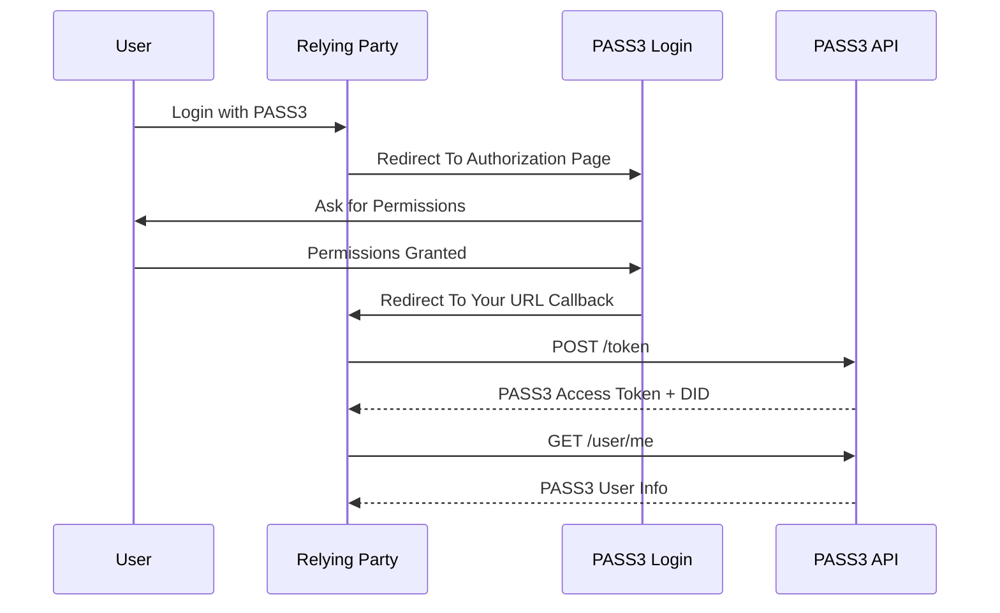

# PASS3 ID Login

## Overview

PASS3 handles all the complexity of underlying self-sovereign identity. PASS3 ID login is the easiest way to connect your website with the self-sovereign identity.

PASS3 ID Login supports OAuth2 integration with your website. OAuth2 is a secure and standardized authorization framework that allows your website to obtain limited access to user resources on behalf of the user. 

**To obtain your OAuth2 credentials, please get in touch with us.**

## Scope

OAuth2 allows users to grant limited access to their protected resources to your site. The scope list will appear on the Authorization consent page.

This is a list of all the OAuth2 scopes that PASS3 supports.

| Name | Description |
|---|---|
| user.identifiers.email_addresses | Access to the list of email addresses associated with the account |
| user.identifiers.phone_numbers | Access to the list of phone numbers associated with the account |
| user.identifiers.web_accounts | Access to web account profiles that are associated with the account. i.e. social media accounts, e-commerce accounts etc |
| user.profile.languages | Access user language preferences |
| user.profile.locations | Access user locations |

## Integrate With PASS3 ID Login

### Button

The easiest way to connect to your website with a button.


Put this snippet code on your login site.

```
<style>
.pass3-login-button {
  font-family: -apple-system,system-ui,"Segoe UI",Helvetica,Arial,sans-serif,"Apple Color Emoji","Segoe UI Emoji";
  font-weight: 600; background-color: #AFEF78; border-radius: 12px; color: #072031;
  padding: 15px 32px; text-align: center; text-decoration: none; display: inline-block;
  font-size: 16px; margin: 4px 2px; cursor: pointer; vertical-align: middle;
}
</style>

<div id="pass3-login-button" class="pass3-login-button">
  <div style="display: inline-block; vertical-align: middle;">
    <svg height=25 width=25 viewBox="0 0 24 24" xmlns="http://www.w3.org/2000/svg" fill="currentColor"><path d="M19.941 7.33667C19.941 4.38934 17.5516 2.00001 14.6043 2.00001H4.00024V7.33582H14.6052V12.6049H14.6727C17.5823 12.6049 19.941 10.2463 19.941 7.33667Z"></path><path d="M4.00012 22H14.605V12.6051H9.26922V16.6642H4.00012V22Z"></path><path d="M9.2691 7.33583H4V12.6049H9.2691V7.33583Z"></path></svg>
  </div>
  <div style="display: inline-block; vertical-align: middle;">Login with PASS3</div>
</div>

<script>  
  const pass3LoginButton = document.getElementById('pass3-login-button');
  const params = {
    response_type: 'code',
    client_id:'${your client id}',
    scope: '${oauth2 scope}'
  };
  const queryParams = '?' + new URLSearchParams(params).toString();
                 
  pass3LoginButton?.addEventListener('click', (e) => {
    e.preventDefault()
    if (typeof window !== "undefined") {
      window.location.href = "https://wallet.pass3.id/authorize"+queryParams;
    }
  });
</script>
```

### Flow

Authorization process using OAuth2 Authorization Code Flow.



1. The user decided to login to your site with their PASS3 Account
2. The page will redirect from your site to PASS3 authorization page
3. PASS3 Login will ask user for permissions
4. User gives permission to your website to obtain their PASS3 Resources with limited access
5. Once a user grants the permissions, the page will redirect to your URL callback with authorization code included. It is used to obtain a token
6. Exchange authorization code for a token to PASS3 API
7. Your site obtained PASS3 Access Token & User DID
8. Access user info through PASS3 API using the access token

### Obtain Access Token

Once a user grants the permissions, the page will redirect to your URL callback with authorization code included. It is used to obtain a token through the following HTTP request.

```
curl -X 'POST' \
  'https://api.pass3.id/iwm/rest/v1/oauth2/token' \
  -H 'accept: application/json' \
  -H "Content-Type: application/json" \
  -H "Authorization: Basic ${credential}" \
  -d '{"grant_type": "authorization_code", "code": "<code>"}'
```

Sample JSON response 

```
{
  "access_token": "eyJhbGciOiJFUzI1NiIs...",
  "token_type": "bearer",
  "expires_in": 2592000,
  "refresh_token": "eyJhbGciOiJFUzI1...",
  "did": "did:ethr:0x9D9Ea56218d726E85234b5003E6319C0fA38fA2d"
}
```

### Obtain User Info

Access user info through PASS3 API using the access token. An example of obtaining user email addresses.

```
curl -X 'GET' \
  'https://api.pass3.id/iwm/rest/v1/user/me/email_addresses' \
  -H 'accept: application/json' \
  -H "Authorization: Bearer ${access_token}"
```

Sample JSON response 

```
{
  "email_addresses": [
    "user@example.com"
  ]
}
```