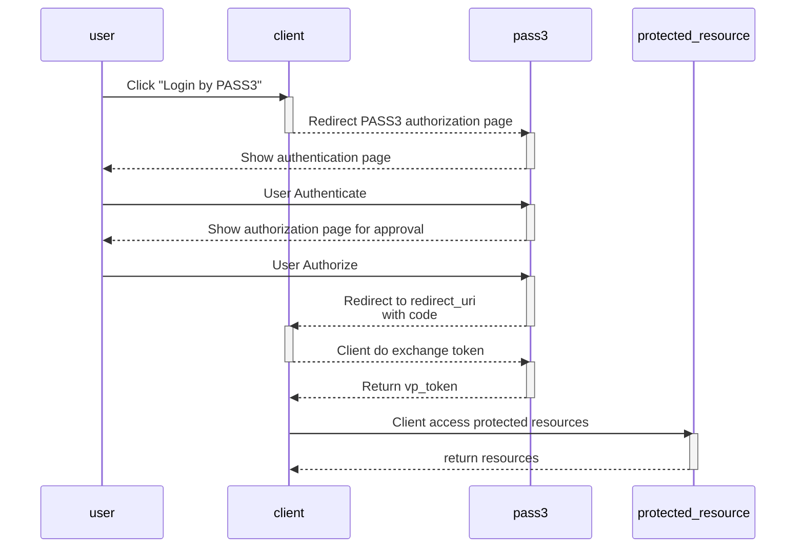

# PASS3 OpenID4VP

### OpenID4VP Diagram

OpenID4VP is an extension of OpenID Connect that allows the exchange of Verifiable Credentials (VC) between the Relying Party (RP) and the Identity Provider (IdP).




## OpenID4VP in PASS3

Here is an example of using OpenID4VP in the Identity SDK with the `authorization code` grant type

You can find the full example [here](https://github.com/pass3id/identity-sdk/tree/main/examples/web-demo)

### Package Install

Install Identity-SDK package

```shell
go get github.com/pass3id/identity-sdk/oi4vp
```

### OAuth2 Client Configuration

The configuration of the OAuth2 client requires the `client_id` and `client_secret`, which can be obtained from PASS3.

```go
var (
	clientID     = os.Getenv("PASS3_OAUTH2_CLIENT_ID")
	clientSecret = os.Getenv("PASS3_OAUTH2_CLIENT_SECRET")
)
```

### OpenID4VP Provider and Verifier

A provider is used to store settings from the authentication server, such as the `auth URL` and `token URL`.

A verifier is used to verify tokens obtained from the authentication server, such as `access tokens` and `VP tokens`.

There are two ways to initiate a provider.

### 1. Auto Lookup Config from OpenID Connect Discovery

```go
ctx := context.Background()

provider, err := oi4vp.NewProvider(ctx, "https://pass3.id")
if err != nil {
    // handle error
}

```

### 2. Manual Config

```go
config := oi4vp.ProviderConfig{
    AuthURL:  "http://localhost:8080/authorize",
    TokenURL: "http://localhost:8080/token",
}

provider := config.NewProvider(context.Background())
```

There are 2 verifier type:
1. `TokenVerifier` for verify registered claims in token like expirations, issuer, audience, etc.
2. `VPTokenVerifier` for verify registerd claims and VCredential signature

Example:

```go
verifier := oi4vp.NewVPVerifier(&oi4vp.Config{
    SkipClientIDCheck: true,
    SkipExpiryCheck:   true,
})

_, err := verifier.Verify(context.Background(), vpToken)

if err != nil {
    // handle error
}

// get claims from VP token
var claims struct {
    VC map[string]interface{} `json:"vc"`
}

if err := verifier.Credentials[0].BuildClaims(&claims); err != nil {
    t.Errorf("%v", err)
}

fmt.Println(claims.VC["id"])
fmt.Println(claims.VC["credentialSubject"])

```

## Configure OAuth2 Client 

Available credential type from PASS3 available in `/oi4vp/credentials.go`.

```go
oauth2Config := oauth2.Config{
    ClientID:     clientID,
    ClientSecret: clientSecret,
    RedirectURL:  "http://client.com/auth/pass3/callback",

    // Discovery returns the OAuth2 endpoints.
    Endpoint: provider.Endpoint(),

    Scopes: []string{LinkedIdentifiers},
}

```
## Create Endpoints Handler

We need two endpoints:

- The first endpoint is used for redirection when the user wants to initiate the "single sign-on" login process.
- The second endpoint is a callback endpoint that receives the authorization code from the provider.

__login redirect endpoint__

```go
http.HandleFunc("/login", func(w http.ResponseWriter, r *http.Request) {
    state, err := randString(16)
    if err != nil {
        http.Error(w, "Internal error", http.StatusInternalServerError)
        return
    }
    nonce, err := randString(16)
    if err != nil {
        http.Error(w, "Internal error", http.StatusInternalServerError)
        return
    }
    setCallbackCookie(w, r, "state", state)
    setCallbackCookie(w, r, "nonce", nonce)

    http.Redirect(w, r, config.AuthCodeURL(state, oi4vp.Nonce(nonce)), http.StatusFound)
})
```

__callback endpoint__

In the callback endpoint handler, we can exchange the authorization code for an access token and VP token.

Then, we perform validation and verification on these tokens.

After that, we extract the `claims` data from the verifiable presentation (VP) token. In this case, the credential is `LinkedIdentifiers`.


```go
http.HandleFunc("/auth/pass3/callback", func(w http.ResponseWriter, r *http.Request) {
    state, err := r.Cookie("state")
    if err != nil {
        http.Error(w, "state not found", http.StatusBadRequest)
        return
    }
    if r.URL.Query().Get("state") != state.Value {
        http.Error(w, "state did not match", http.StatusBadRequest)
        return
    }

    oauth2Token, err := config.Exchange(ctx, r.URL.Query().Get("code"))
    if err != nil {
        http.Error(w, "Failed to exchange token: "+err.Error(), http.StatusInternalServerError)
        return
    }

    vpToken, ok := oauth2Token.Extra("vp_token").(string)
    if !ok {
        http.Error(w, "No vp_token field in oauth2 token.", http.StatusInternalServerError)
        return
    }

    token, err := verifier.Verify(ctx, accessToken)
    if err != nil {
        http.Error(w, "Failed to verify VP Token: "+err.Error(), http.StatusInternalServerError)
        return
    }

    nonce, err := r.Cookie("nonce")
    if err != nil {
        http.Error(w, "nonce not found", http.StatusBadRequest)
        return
    }
    if token.Nonce != nonce.Value {
        http.Error(w, "nonce did not match", http.StatusBadRequest)
        return
    }

    w.Write("jos")
})
```

### Presentation Definition

The `presentation definition` is used to define the credential that we want to request from the authentication server.

```go

pd := &PresentationDefinition{
    ID: "LinkedIdentifiers",
    InputDescriptors: []InputDescriptor{
        {
            ID: "id card credential",
            Format: map[string]any{
                "ldp_vc": map[string]any{
                    "proof_type": []string{"Ed25519Signature2018"},
                },
            },
        },
    },
}

pdstr, _ := pd.String()

url := oauthConfig.AuthCodeURL(oauthState, oauth2.SetAuthURLParam("presentation_definition", pdstr))
```

Presentation Definition from URI
    
```go
pd, _ := PresentationDefinitionFromURI("https://example.com/presentationdefs?ref=idcard_presentation_request")

pdstr, _ := pd.String()

url := oauthConfig.AuthCodeURL(oauthState, oauth2.SetAuthURLParam("presentation_definition", pdstr))

```

### Presentation Submission

The `presentation submission` contains mappings between the requested Verifiable Credentials and where to find them within the returned VP Token

```go
// after get VP token from callback endpoint

token, err := oauthConfig.Exchange(context.Background(), code)
if err != nil {
    // handle error
}

psstr := token.Extra("presentation_submission").(string)

ps, _ := PresentationSubmissionFromString(psstr)

fmt.Println(ps.ID)
```